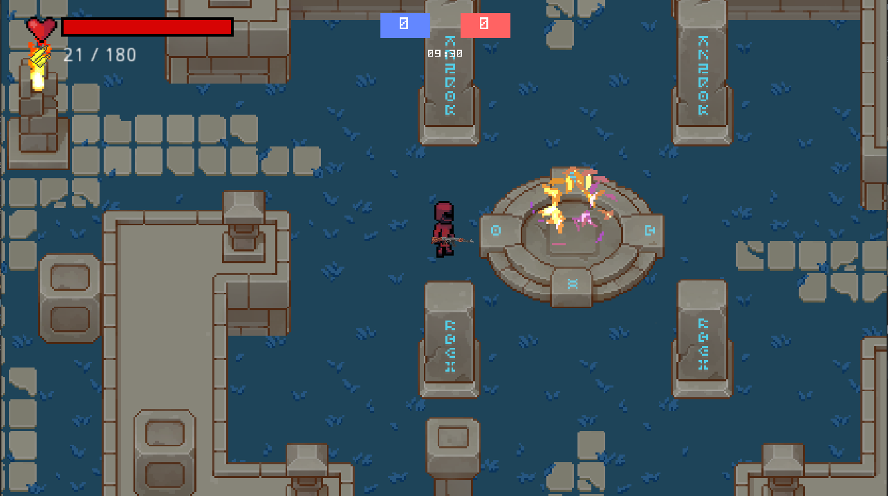

# InVasion

## Описание проекта:

Действия происходят в далеком будущем. Люди вторгаются на чужую планету с целью захвата ресурсов другой цивилизации. В сражении участвуют две команды: люди и пришельцы.
Задача обеих команд сохранить лидерство по очкам до конца игровой сессии.  

### Управление:
`W`/`up` **- движение вверх**

`A`/`left` **- движение влево**

`D`/`right` **- движение вправо**

`S`/`down` **- движение вниз**

`E` **- использовать аптечку/набор патронов**

`R` **- перезарядить оружие**

`F` **- поставить аптечку/набор патронов**

`Tab` **- статистика матча**

`Esc` **- открыть игровое меню во время матча**

## Скриншоты, демо-видео: 

## Сборка проекта:

### [Настройка клиента](./client/README.md)

### Настройка сервера: TODO