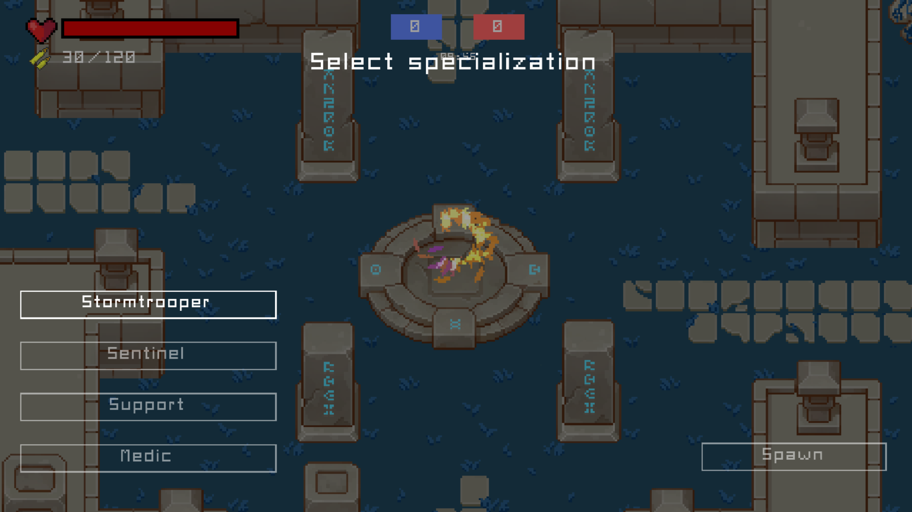
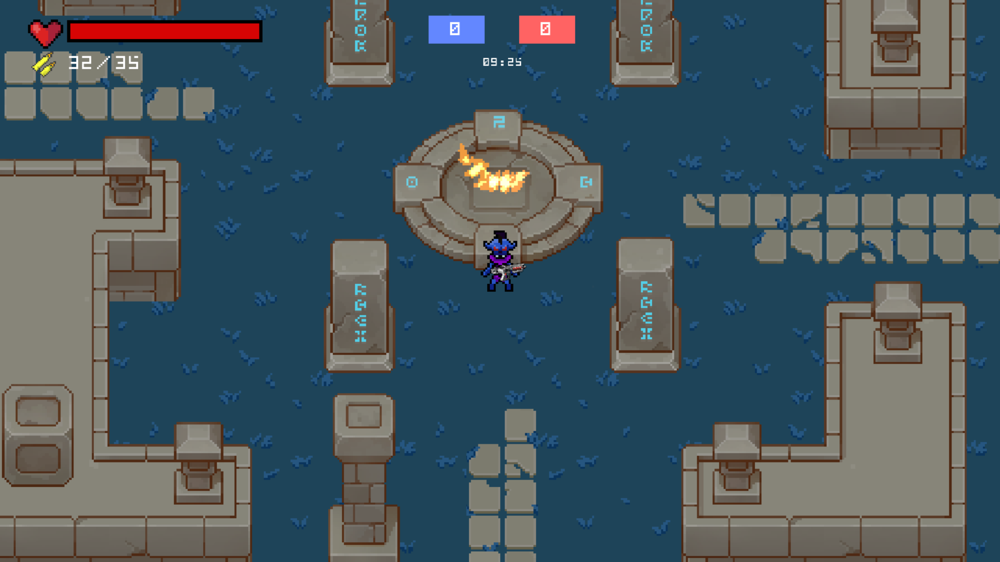

# InVasion
<div style="text-align: center;">
    
</div>

## Описание проекта:

Действия происходят в далеком будущем. Люди вторгаются на чужую планету с целью захвата ресурсов другой цивилизации. В сражении участвуют две команды: люди и пришельцы.
Задача обеих команд сохранить лидерство по очкам до конца игровой матча.  


### Управление:

| Кнопки | Действие | | Кнопки | Действие |
| --- | --- | --- | --- | --- |
| `W` / `up` | движение вперед |  | `E` | использовать аптечку/набор патронов |
| `A` / `left` | движение влево |  | `F` | поставить аптечку/набор патронов |
| `S` / `down` | движение назад |  | `R` | перезарядить оружие |
| `D` / `right` | движение вправо |  | `Tab` | просмотреть статистику матча |
| `Esc` | открыть игровое меню во время матча |  |


## Демонстрация проекта: 

Презентация, использованная при защите проекта - [ссылка](https://docs.google.com/presentation/d/1lBzSjmXYhELPg0OBNJKAoncFke5LDX_C9CTU3kSo5jA/edit?usp=sharing).

Нарезка игрового процесса:

[](https://www.youtube.com/watch?v=mrqsUgST12c)


Внутриигровые скриншоты:
<div style="text-align: center;">
    
    
</div>

## Сборка проекта:

### Настройка клиента:
Необходимо скачать [редактор Godot](https://godotengine.org/download/windows). При разработке мы использовали версию `v3.4.2`, ее можно установить, перейдя по [ссылке](https://downloads.tuxfamily.org/godotengine/3.4.2/).

Далее необходимо открыть файл `/client/godot/game/default_env.tres` внутри движка, после чего можно начинать редактирование исходников клиентского кода.

### Настройка сервера: 

При сборке под Windows рекомендуем использовать пакетный менеджер [vcpkg](https://github.com/microsoft/vcpkg) для установки всего перечисленного ниже.

Для сборки сервера необходимо установить [boost](https://www.boost.org/), мы разрабатывали на версии `v1.71.0`, ее можно установить по [ссылке](https://www.boost.org/users/history/version_1_71_0.html).

Также необходимо установить компилятор [protocol buffers](https://developers.google.com/protocol-buffers/docs/downloads), мы использовали версию `v3.18.0`, ее можно установить по [ссылке](https://github.com/protocolbuffers/protobuf/releases/tag/v3.18.0).

Последнее, что необходимо к установке — [sqlite](https://www.sqlite.org/index.html).

P.S. Если у вас Linux и не запускается sqlite, то установка дополнительных компонентов должна решить проблему

```sh
sudo apt update
sudo apt-get install libsqlite3-dev
sudo apt-get install sqlite3
```
